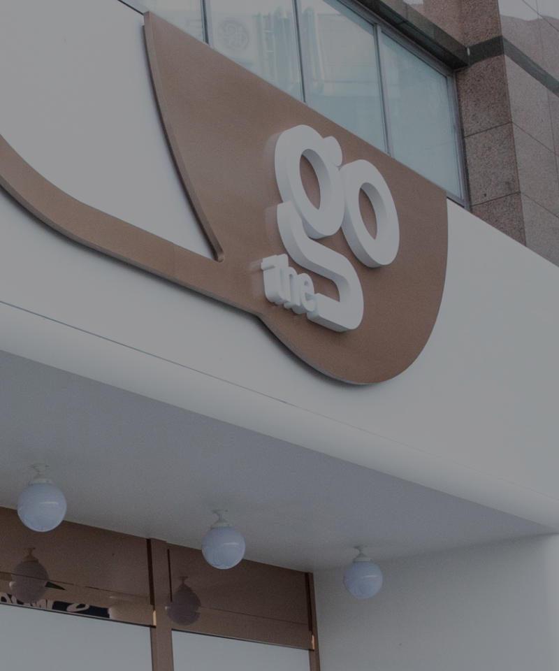
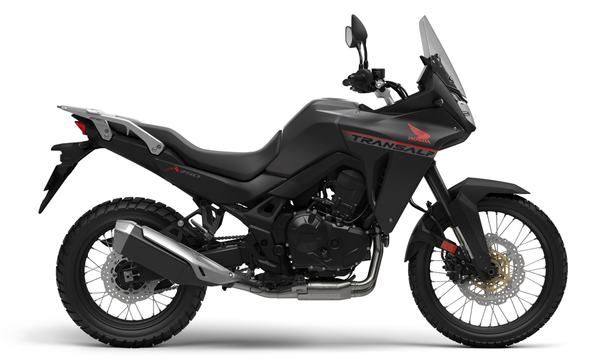
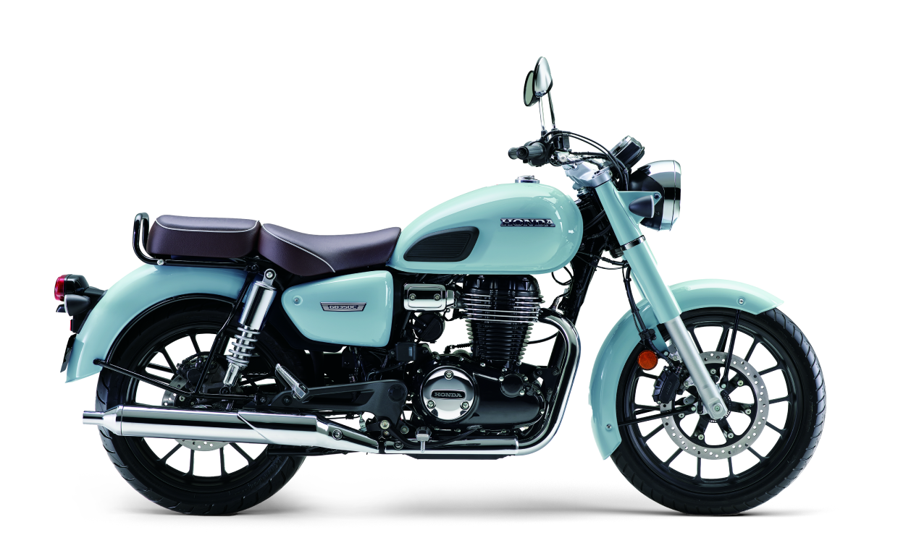
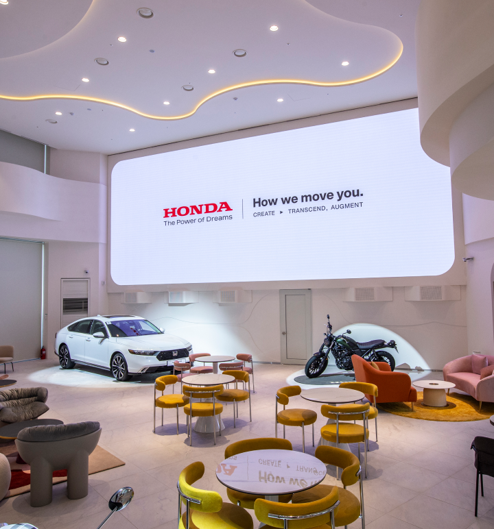

# Honda cafe 'The go' 웹사이트 리디자인 & 클론
<br>
메인, 로그인 페이지 반응형 웹사이트<br>
제작시기 : 2025.02<br><br>
Demo : https://kminjoo9093.github.io/Honda-redesign/
<br><br><br>


<br><br><br><br>

## ☝️ &nbsp; 목표
1. 사용자 편의성을 고려한 UI 개선
2. GSAP 활용하여 인터랙티브 웹 사이트 제작
3. 키보드 탭 포커스 관련 접근성 고려
4. 구글 지도 오픈 API 활용
<br><br><br><br>

## 🛠&nbsp; 사용 스킬
- HTML
- CSS
- JAVASCRIPT
- JQUERY
- GSAP
- SWIPER

<br><br><br><br>

## 💡 &nbsp; UI 개선사항
### 1. 슬라이드 carousel 형태로 배치
- 차량의 종류를 한눈에 파악하고 구분 가능<br>


<br><br><br>
<hr>

### 2. 자동차와 모터사이클 코스의 행을 달리 하고 배경이미지를 가리지 않도록 배치
- 배경 이미지 강조로 두 코스를 더욱 직관적으로 구분 가능<br><br>


<br><br><br>
<hr>

### 3. 예약하기 버튼과 스크롤바 추가
- 버튼 추가로 코스 확인 후 바로 예약 링크로 이동 가능<br>
- 스크롤바 추가로 다른 코스가 있음을 짐작 가능<br><br>


<br><br><br>
<hr>

### 4. 지도 영역 여백 추가
- PC버전에서 아래로 이동하기 위한 스크롤에 지도가 반응하는 것을 방지하기 위해 여백 추가 <br><br>


<br><br><br>
## 💻&nbsp; 주요 기능
### 1. gnb 키보드 탭 포커스
<br>

**[ HTML ]**
   
```html
<div class="gnb" role="dialog" aria-labelledby="menu" aria-hidden="true">
        <h2 id="menu" class="ally-hidden">메인메뉴</h2>
        <div class="nav-col-wrap">
          <div class="nav-col nav-col-01">
            <div class="nav-list">
              <button class="active theGo-btn" data-nav="the-go">
                Cafe 'The go'
              </button>
              <button class="myPage-btn" data-nav="my-page">My page</button>
            </div>
            <div class="cs-container" aria-labelledby="cs-center" role="group">
              <p class="cs-heading" id="cs-center">Honda 고객센터</p>
              <p class="cs-number">1588-3250</p>
              <span class="cs-time"
                >평일 09:00 ~ 18:00<br />(토/일요일, 공휴일 휴무)</span
              >
            </div>
          </div>
          <div class="nav-col nav-col-02">
            <div class="theGo-content active" id="the-go">
              <p class="subNav-list">
                <a href="#">Cafe 'The go'소개</a>
                <a href="#">시승예약</a>
                <a href="#">시승예약내역</a>
              </p>
              <p class="nav-img">
                
              </p>
            </div>
            <div class="myPage-content" id="my-page">
              <p class="subNav-list">
                <a href="#">시승예약내역</a>
                <a href="#">회원정보확인/수정</a>
              </p>
              <p class="nav-img">
                
              </p>
            </div>
          </div>
        </div>
        <p class="nav-btns">
          <a href="login.html" class="myPage-icon-w">
            
          </a>
          <button class="close-icon-w">
            
          </button>
        </p>
      </div>
```
<br>

**[ JS ]**

```javascript
const openMenu = document.querySelectorAll(".nav-btns .menu-icon");
const closeMenu = document.querySelector(".close-icon-w");
const gnb = document.querySelector(".gnb");
const gnbBg = document.querySelector(".gnb-dim");

openMenu.forEach((btn)=>{
  btn.addEventListener("click", () => {
    handleGnb(true, ".theGo-btn");
  });
})
  
closeMenu.addEventListener("click", () => {
  handleGnb(false, ".page-nav a");
});
closeMenu.addEventListener("keydown", (e) => {
  if (e.key === "Enter") {
    handleGnb(false, ".page-nav a");
  }
});

const handleGnb = (isOpen, targetFocus) => {
  [gnb, gnbBg].forEach((i) => {
    if (isOpen) {
      i.classList.add("active");
    } else {
      i.classList.remove("active");
    }
  });
  gnb.setAttribute("aria-hidden", !isOpen);

  document.querySelector(targetFocus).focus();
};

// gnb tab focus
$(".nav-list button").keydown(function (e) {
  if (e.key === "Enter") {
    $(this).siblings().removeClass("active");
    $(this).addClass("active");

    $(".nav-col-02 > div").removeClass("active");
    $("#" + $(this).attr("data-nav")).addClass("active");
  }
});
```
<br><br>
1️⃣ &nbsp; 메뉴 버튼 클릭,엔터 시 GNB의 첫번째 메뉴로 탭 포커스 이동, aria-hidden은 false<br><br>
2️⃣ &nbsp; 메뉴 닫기 버튼 클릭,엔터 시 메인 페이지의 첫번째 메뉴로 탭 포커스 이동, aria-hidden은 true<br><br>
3️⃣ &nbsp; GNB 메뉴 엔터 후 해당 메뉴의 하위 메뉴로 탭 포커스 이동<br>
  &nbsp;&nbsp; : 메뉴의 사용자 정의 속성 'data-nav'값과 하위 메뉴의 id로 연결<br>
<br><br><br>
<hr>

### 2. 시승 차량 모델명 업데이트


<br><br>

**[ HTML ]**

```html
<!--슬라이드 구조-->
<p class="slide-heading bike">모터사이클</p>
<p class="bike-name first-show"></p>
<div class="bike-slide">
  <div class="swiper bike-swiper">
    <div class="swiper-wrapper">
      <!-- Slides -->
      <div class="swiper-slide">
        <p class="slide-item-name bike">XL750</p>
        
      </div>
      <div class="swiper-slide">
        <p class="slide-item-name bike">GB350C</p>
        
      </div>
        .
        .
        .
    </div>
  </div>
</div>
```
<br>

**[ JS ]**

```javascript
// =========== section04 Car / Bike Change Name ===========
swiper1.on("slideChange", function () {
  updateName(".car-swiper", ".car-name");
});
swiper2.on("slideChange", function () {
  updateName(".bike-swiper", ".bike-name");
});

function updateName(swiperSelector, nameSelector) {
  const itemName = document.querySelector(nameSelector);
  itemName.textContent = "";
  itemName.classList.remove("first-show", "active");
  setTimeout(() => {
    showItemName(swiperSelector, nameSelector);
  }, 100);
}

function showItemName(slideTarget, name) {
  const slide = document.querySelector(slideTarget);
  const itemName = document.querySelector(name);
  const activeSlide = slide.querySelector(".swiper-slide-active");
  const nameContent = activeSlide.querySelector(".slide-item-name").textContent;

  itemName.textContent = nameContent;
  itemName.classList.add("active");
}

showItemName(".car-swiper", ".car-name");
showItemName(".bike-swiper", ".bike-name");
```

<br><br>

1️⃣ &nbsp; slide-item-name은 display: none;으로 설정하고 textContent로 활용<br><br>
2️⃣ &nbsp; 슬라이드 변경 시 updateName 호출<br>
&nbsp;&nbsp; updateName 함수에서 차량 이름을 초기화하고 active 클래스 제거<br>
&nbsp;&nbsp; ** active 클래스 제거 이유 : 애니메이션 효과를 다시 적용하기 위해
<br><br>
❌ &nbsp; **이슈** : 슬라이드 변경 후 updateName함수에서 active추가한 후 애니메이션 효과가 적용되지 않는 현상<br>
3️⃣ &nbsp; **해결** : setTimeout을 통해 클래스 추가 지연<br>
  &nbsp;&nbsp;    setTimeout을 사용해 시간을 두고 DOM이 업데이트된 후 showItemName을 호출. active 클래스를 추가하여 애니메이션 효과 적용

<br><br><br>
<hr>

### 3. 시승 코스 클릭 시 해당 코스 설명하는 슬라이드 모달창 띄우기
<br>

**[ JS ]**

```javascript
var carSwiper = new Swiper(".swiper.car", {
  slidesPerView: 1,
  spaceBetween: 100,
  loop: true,
  scrollbar: {
    el: ".swiper-scrollbar",
    hide: false,
  },
});
var bikeSwiper = new Swiper(".swiper.bike", {
  slidesPerView: 1,
  spaceBetween: 100,
  loop: true,
  scrollbar: {
    el: ".swiper-scrollbar",
    hide: false,
  },
});

openModal(".car-course-wrap", "car", carSwiper);
openModal(".bike-course-wrap", "bike", bikeSwiper);

function openModal(courseWrap, type, swiper) {
  const modalWrap = document.querySelector(".modal-wrap.course");
  const course = document.querySelector(courseWrap);
  const courseBtns = course.querySelectorAll(".course-item");

  courseBtns.forEach((btn, index) => {
    btn.addEventListener("click", () => {
      modalWrap.classList.add("show");
      const modals = document.querySelectorAll(".swiper.modal");
      Array.from(modals).forEach((modal) => {
        if (modal.dataset.type === type) {
          modal.classList.add("show");
          // 클릭한 슬라이드가 보이도록
          swiper.slideToLoop(index);
          swiper.update();
        }
      });
    });
  });
}
```

<br>

1️⃣ &nbsp; car / bike 중 'data-type' 일치하는 모달 오픈하도록<br><br>
2️⃣ &nbsp; 모달창 오픈 후 클릭된 코스의 index를 받아서 slideToLoop(Index)로 해당 코스로 슬라이드 이동 설정, swiper.update()<br><br>

<br><br><br>

## 🎨 &nbsp; 주요 스타일
<br>

### 1. 스크롤 인디케이터 애니메이션
<br>

<br><br>

1️⃣ &nbsp; translateX와 skewY속성 활용하여 좌,우 데칼코마니 도형으로 화살표 제작 <br><br>
2️⃣ &nbsp; 세개의 요소에 scale, translateY 값이 변하는 애니메이션을 순차적으로 적용한다 <br><br>
3️⃣ &nbsp; IntersectionObserver를 활용해 section01이 뷰포트에 들어올때만 이 인디케이터가 보이도록 한다<br><br>


**[ CSS ]**

```css
.chevron:nth-child(1) {
  animation: chevron 3s 1s ease-in-out infinite;
}
.chevron:nth-child(2) {
  animation: chevron 3s 2s ease-in-out infinite;
}
.chevron:nth-child(3) {
  animation: chevron 3s 3s ease-in-out infinite;
}
.chevron-el {
  width: 1.2rem;
  height: 0.5rem;
  background-color: #fff;
  position: absolute;
  left: 50%;
  top: 10%;
}
.chevron-el.left {
  transform: translateX(-50%) skewY(30deg);
}
.chevron-el.right {
  transform: translateX(50%) skewY(-30deg);
}
@keyframes chevron {
  0% {
    opacity: 0;
    transform: scale(0.3) translate(0.7rem, 0);
  }
  30% {
    opacity: 1;
    transform: scale(1) translateY(2rem);
  }
  35% {
    opacity: 1;
    transform: scale(1) translateY(2.1rem);
  }
  40% {
    opacity: 1;
    transform: scale(1) translateY(2.2rem);
  }
  45% {
    opacity: 1;
    transform: scale(1) translateY(2.3rem);
  }
  100% {
    opacity: 0;
    transform: scale(0.3) translate(6px, 10rem);
  }
}
```
<br>

**[ JS ]** <br>

```js
// section01 chevron
showChevron();

function showChevron(){
  const section01 = document.querySelector('#section01');
  const chevronObserver = new IntersectionObserver(entries=>{
    entries.forEach(e=>{
      if(e.isIntersecting){
        document.querySelector('.ani-chevron').style.display = 'block';
      } else {
        document.querySelector('.ani-chevron').style.display = 'none';
      }
    })
  }, {
    threshold: 0.7  
  })

  chevronObserver.observe(section01);
}
```


<br><br><br>
<hr>

### 2. 빨간 원 궤도 돌며 작아지기

<br>

<br><br>

1️⃣ &nbsp;  빨간 원이 도는 궤도를 마련하기 위한 .circle-rotate 요소를 .circle-left 요소와 동일한 곳에 위치시킨다 <br><br>
2️⃣ &nbsp;  GSAP으로 section02가 뷰포트에 위치하는 지점과 함께 .red-circle의 scale값, .circle-rotate의 rotation값을 설정한다 <br><br>


**[ HTML ]**

```html
<div class="img-circle circle-left">
  
</div>
<div class="circle-rotate">
  <p class="red-circle"></p>
</div>
```
<br>

**[ GSAP ]**

```js
// section02 red-circle
  gsap
    .timeline({
      scrollTrigger: {
        trigger: "#section02",
        start: "50% 100%",
        end: "100% 100%",
        scrub: true,
      },
    })
    .set(".red-circle", { scale: 1, ease: "none" })
    .to(".red-circle", { scale: 1.5, ease: "none"});

  // section02 circle rotate
  gsap
    .timeline({
      scrollTrigger: {
        trigger: "#section02",
        start: "40% 100%",
        end: "100% 100%",
        scrub: true,
      },
    })
    .from(".circle-rotate", { rotation: 0, ease: "power1.out" })
    .to(".circle-rotate", { rotation: -45, ease: "power1.out" });
```
<br><br>

### 🧪 &nbsp; GSAP 활용 전 시도한 방법

```js
//circle rotate & scale
let rotationValue = 0;
let scaleValue = 1;
section02.addEventListener('wheel', (e)=>{
 if(e.deltaY > 0){
   rotationValue -= 5;
   rotateCircle.style.transform = `rotate(${rotationValue<-40?-40:rotationValue}deg)`;
   scaleValue += 0.05;
   redCircle.style.transform = `translate(50%, -50%) scale(${scaleValue>1.3?1.3:scaleValue})`;
 } else {
   rotationValue += 5;
   rotateCircle.style.transform = `rotate(${rotationValue>0?0:rotationValue}deg)`;
   scaleValue -= 0.05;
   redCircle.style.transform = `translate(50%, -50%) scale(${scaleValue<1?1:scaleValue})`;
 }
})
```
<br>
1️⃣ &nbsp; 회전값과 크기값으로 활용할 rotationValue, scaleValue 변수를 선언하고 시작 값을 할당<br><br>
2️⃣ &nbsp; wheel이벤트리스너로 스크롤을 내릴때마다(deltaY값이 0이상) rotationValue 값은 -= 5, scaleValue 값은 += 0.05 씩 가감시키고 일정 위치에서 회전과 크기가 멈춰야 하기 때문에 각각 한계값을 정하고 그 이상으로 진행되지 않도록 한다 <br><br>
3️⃣ &nbsp; 스크롤을 올리면 다시 처음 위치와 크기로 돌아와야 하기 때문에 회전값과 크기값을 반대로 가감시키며, 처음 설정한 값을 한계값으로 한다<br><br>

❗️&nbsp; GSAP의 위대함을 느꼈다 . . .
